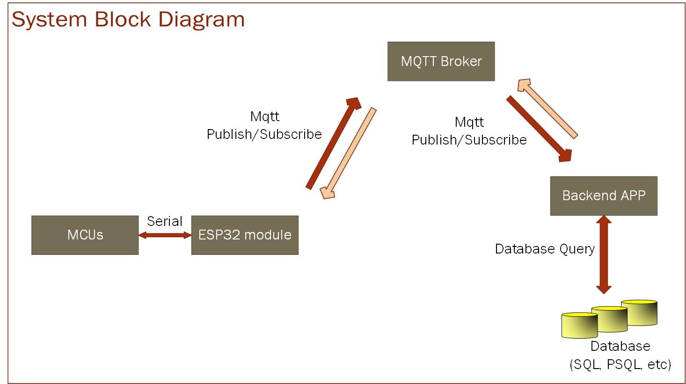

# mqtt_client_fileserver
This project is to verify file transfer through MQTT, and composed by two independent process (FileSender and FileReceiver). File transferring is performed with Request-Response pattern of MQTT. 
See  [here](https://www.hivemq.com/blog/mqtt5-essentials-part9-request-response-pattern/)


## Main steps for file transfering
* _FileRecevier_ publish the message in predefined topic(_**topic-1**_) which means for file downloading request.
_**Topic-1**_ contains the responseTopic(_**topic-2**_) to which _FileSender_ should publish the file content in it. 
* _FileSender_ reads the _**topic-1**_, then determine of which file should be sent by querying into database. 
* _FileSender_ splits binary file into multiple chunks(one chunk size is 1024 bytes as default), and publish the first chunk to _Responsetopic_(=_**topic-2**_) of topic-1. **NOTE** that _ResponseTopic_ of _**topic-2**_ is _**topic-3**_, which _FileSender_ should send acknowldege message to.
* _Filesender_ sends the next packet after reads the success message in _**topic-3**_. If it reads the failed signal in acknowledge message, it sends the current chunk again. The same steps are repeated until all packet are been sent. 


Data flow between sender and receiver is shows in below figure. 
 
## system block diagram
 
 
## Data flow for MQTT file transfering 


## How to run 
### (1) Install MQTT Broker

I have use EMQX broker. Official document can be found [here](https://www.emqx.io/docs/en/v5.0/deploy/install.html) and detailed document will be provided in my another repository soon.

### (2) Install python dependency
install python 3.4+ 
```
pip install paho-mqtt
pip install commentjson
```
_**paho-mqtt**_ is open source python library of MQTT client, and can be found [here](https://github.com/eclipse/paho.mqtt.python)

### (3) Edit configure file
* open [common/config.json](common/config.json), and edit value. Meaning of each parameters are: 
```json
{
    "server":{
        "host": "192.168.101.193",                  # Host name or local IP address of MQTT broker
        "port": 8883,                               # 1883 for tls is false(http), 8883 for tls=true(https) 
        "qos": 1,                                   # QoS of MQTT packet 
        "keep_alive":60,                            # keep alive time in second
        "tls": true,                                # true for use https 
        "insecure": false,              
        "cli_verify": true,                         # true if perform client verification. 
        "server_ca": "security/emqx.org.crt",       # path of CA cerfiticate file of server
        "cli_cert":"security/client.crt",           # path of client certification file
        "cli_key": "security/client.key",           # path of client certification key file 
        
    },
    "topic": 
    {
        "topic_request": "/sip/inductive/firmware/esp32-wroom-32d/request",                 # predefined topic to request file download
        "topic_response": "/sip/inductive/firmware/esp32-wroom-32d/response"                 # default prefix of send channel topic. 
    },
    "file":{
        "src": "asset/MQTT.jpg",                    # test file to send
        "dst": "asset/MQTT_received.jpg"            # file path to save the received data(will be overwriited)
    }
}
```
**NOTE:** 
*  If you using EMQX and wants to test TLS option, it needs to generate certificate files. See [github](https://github.com/emqx/emqx-webinars/tree/main/2022-02-09-emqx-tls/scripts) and [youtube video 1](https://www.youtube.com/watch?v=HRqJLi7-9KU) and [youtube video 2](https://youtu.be/W7SedpZzQdo)

 
### (4) Lauch script. 
* delete _**"assert/MQTT_received.jpg"**_(_cfg/file/dst_ field)
* check _**"assert/MQTT.jpg"**(_cfg/file/src_ field) file eixts
* In project root directory, run
```
python3 main.py
```
* onece script has been executed, you can see  _**"assert/MQTT_received.jpg"** is received via MQTT file transfer.